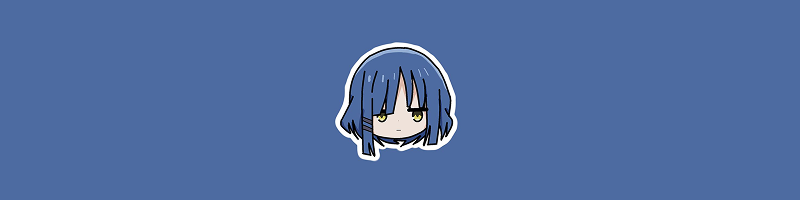
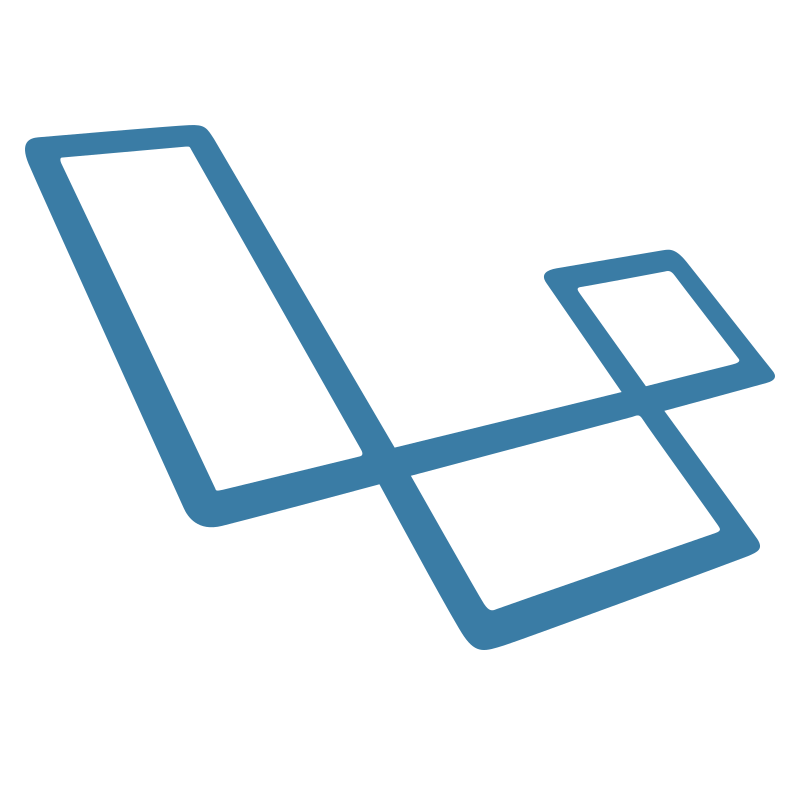
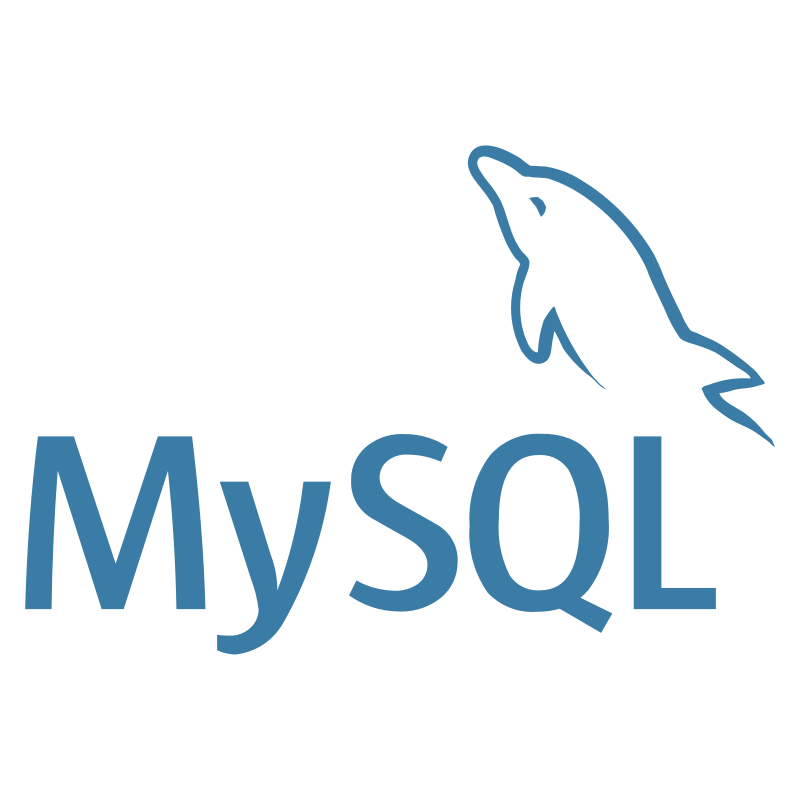
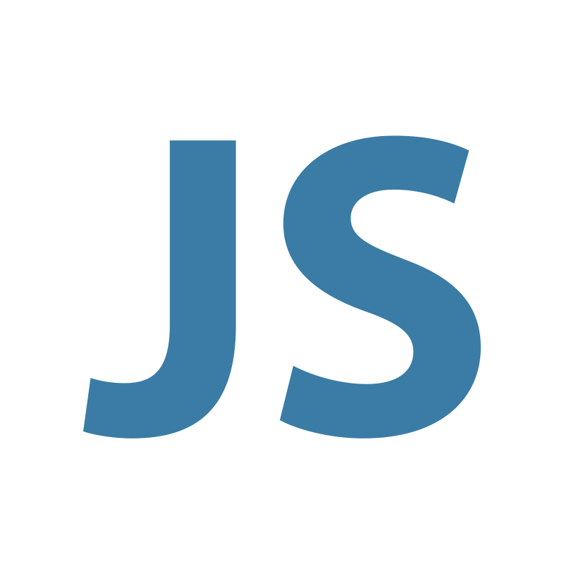
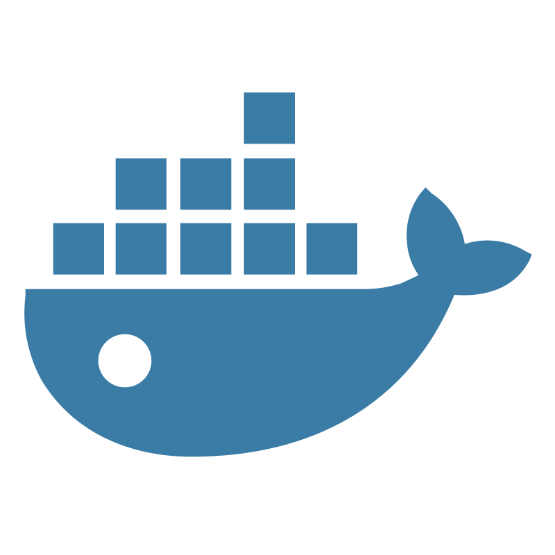
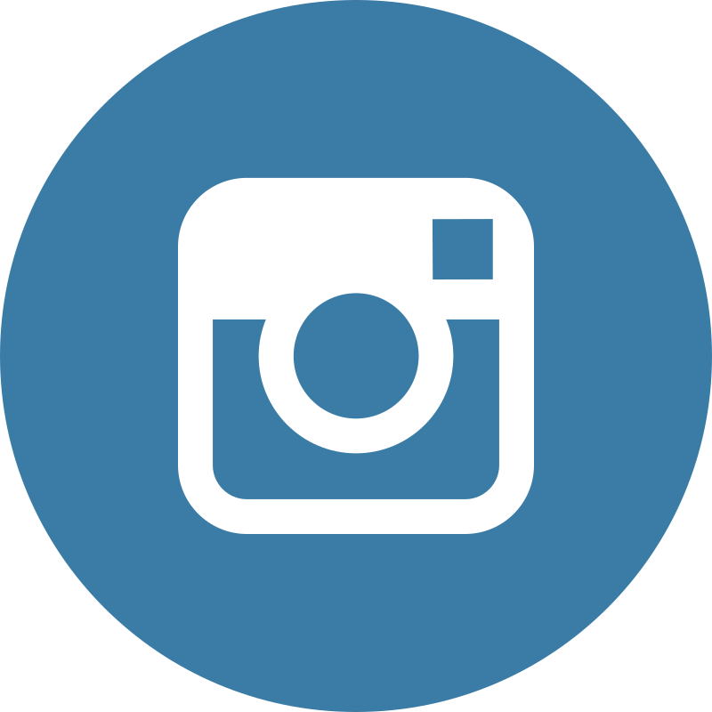
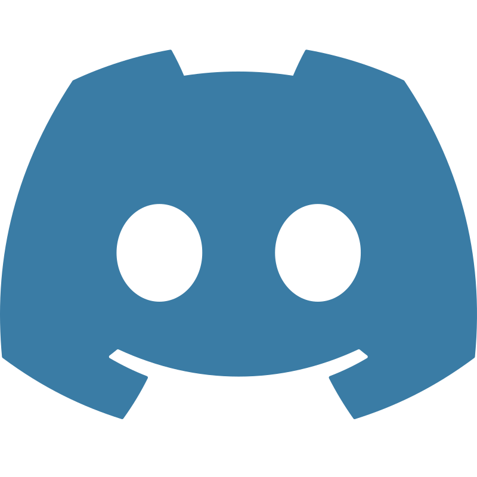

# Hi there 👋!

   

 

   I enjoy designing minimalist and structured things, such as website designs, posters, and others. And sometimes I also like to experiment with Android. 

<ul>
   <li>🧐 Interested in full-stack web development</li>
   <li>🌱 Currently learning Laravel and Linux</li>
   <li>☕ I like coffee and music</li>
   <li>😑 I'm not a simp</li>
</ul>

## My Stacks :

   
   
   
   

   <em>check out my other social media too!</em>

 

  
  
  

 

   

